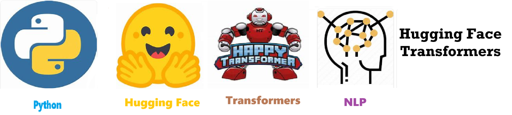
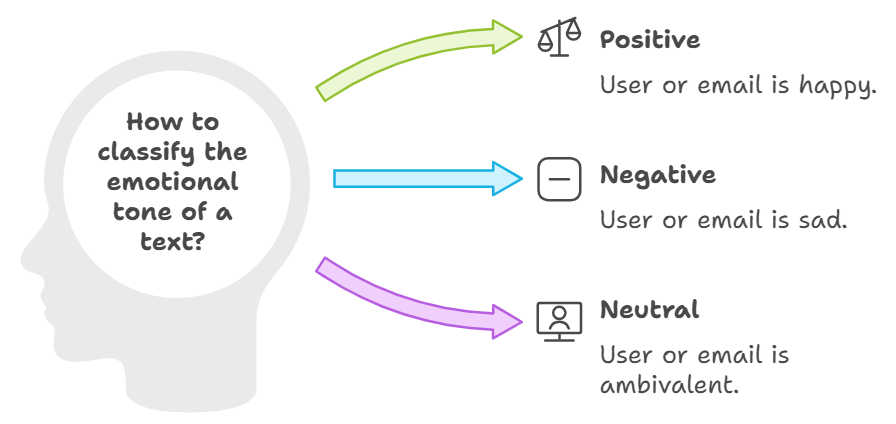
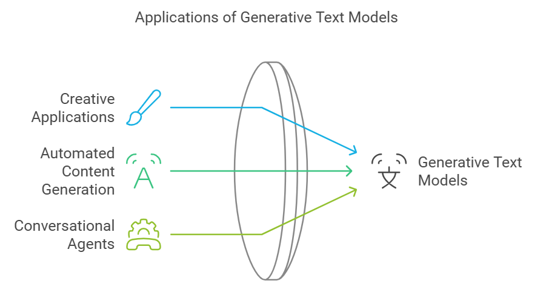
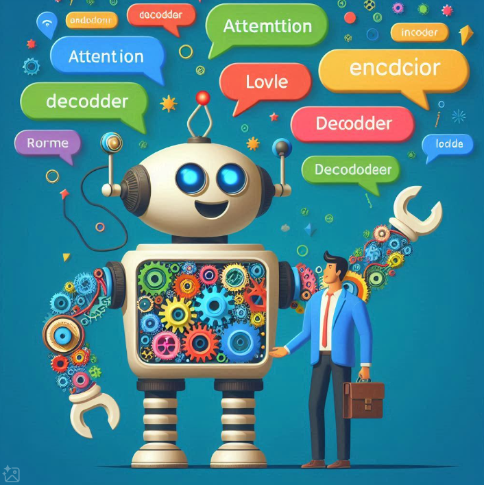
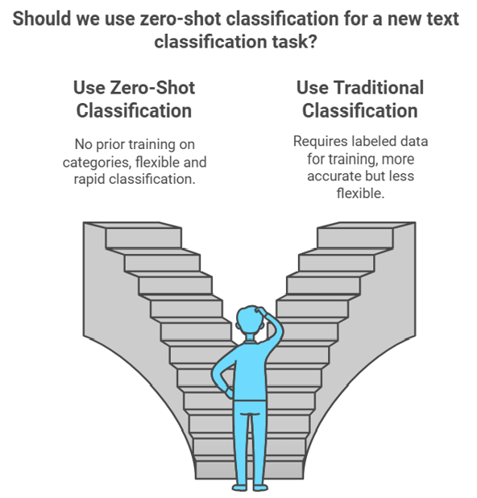

    
# Hugging Face Transformers 

## hugging_face_transformers

    

    
## Table of Contents

- [Solution Overview](#solution-overview)
- [Who will use this ?](#who-can-use)
- [Advantages of Using](#advantages-of-using)
- [Return on Investment (ROI)](#return-on-investment-roi)
- [How it Works](#how-it-works)
- [Conclusion](#conclusion)
- [Getting Started](#getting-started)
- [Solution Features](#solution-features)
- [Code Features](#code-features)
- [Deliverables or Figures](#deliverables-or-figures)
- [Contact Information](#contact-information)

## Hugging Face Overview

**Hugging Face** is a leading open-source platform that focuses on **Natural Language Processing (NLP)** and **Machine Learning (ML)**, offering a vast collection of pre-trained transformer models like **BERT**, **GPT**, and **T5**. It simplifies the development, fine-tuning, and deployment of these models, making cutting-edge AI accessible to developers and researchers. Hugging Face also fosters an active community where users can share models and contribute to the ecosystem. Beyond NLP, it is expanding into other domains like **computer vision** and **audio processing**. Hugging Face is widely recognized for democratizing AI technology, promoting both **collaboration** and **innovation**.

## Hugging Face Transformer Goals

The primary purpose of **Hugging Face Transformers** is to provide an open-source library that simplifies the development and deployment of **state-of-the-art Natural Language Processing (NLP) models**, specifically those built on **transformer architectures** like **BERT**, **GPT**, **T5**, and others. Hugging Face allows researchers and developers to use pre-trained models easily, fine-tune them for specific tasks, and deploy them for various NLP applications such as **text classification**, **translation**, **question answering**, **text generation**, and more.

### **Goals of Hugging Face Transformers:**

1. **Accessibility and Democratization of NLP**:
   - Hugging Face aims to make cutting-edge NLP technology more **accessible** to a broader audience, including non-experts in machine learning. The library abstracts much of the complexity behind building and training transformer models, allowing developers to integrate these models into their applications with minimal effort.

2. **Pre-Trained Models for Efficiency**:
   - Hugging Face provides a vast collection of **pre-trained models** that can be fine-tuned for various tasks without the need to start from scratch. This saves computational resources and time, making NLP development more **efficient** and practical, even for those without extensive resources.

3. **Community-Driven and Open-Source**:
   - One of Hugging Face’s key goals is to foster an **open-source community** where developers and researchers can share models, contribute to improvements, and collaborate. This encourages continuous innovation and the democratization of powerful NLP tools, helping advance the field faster.

4. **Flexibility Across Domains**:
   - Hugging Face transformers are designed to be highly **versatile**, supporting tasks in numerous domains beyond NLP, including **computer vision** and **audio processing**. The goal is to make transformers a universal tool for AI research and applications.

Overall, Hugging Face Transformers has become a leading platform for those seeking to integrate **transformer-based models** into their workflows with ease, promoting faster development and deployment of AI models in real-world applications.

## Hugging Face Transformer Examples

Here’s a brief overview of the **purpose and goals** of Hugging Face Transformer examples:

1. **Zero-Shot Classification**: The goal of zero-shot classification is to allow a model to classify text into predefined categories **without any prior training on those categories**. This is particularly useful in scenarios where labeled data is unavailable or costly to obtain, enabling rapid and flexible classification across various domains.

2. **Sentiment Analysis**: Sentiment analysis models aim to determine the **emotional tone** behind a piece of text, such as whether a review is positive, negative, or neutral. Hugging Face provides pre-trained models that can easily be fine-tuned or applied to tasks where understanding public opinion or customer feedback is essential.

3. **Generative Text**: Generative text models, like GPT, are designed to **create human-like text** based on a given input. These models can generate stories, complete sentences, answer questions, or even write code, making them useful for creative applications, automated content generation, and conversational agents.

Each of these examples leverages Hugging Face’s transformer models to address specific NLP tasks, enhancing productivity and reducing the need for large amounts of labeled data or complex training processes.

    

    
## Getting Started

The goal of this solution is to **Jump Start** your development and have you up and running in 30 minutes. 

To get started with the **Hugging Face Transformers** solution repository, follow these steps:
1. Clone the repository to your local machine.
2. Install the required dependencies listed at the top of the notebook.
3. Explore the example code provided in the repository and experiment.
4. Run the notebook and make it your own - **EASY !**
    
## Solution Features

- Easy to understand and use  
- Easily Configurable 
- Quickly start your project with pre-built templates
- Its Fast and Automated
- Saves You Time 

## Code Features

These features are designed to provide everything you need for **Hugging Face Transformers** 

- **Self Documenting** - Automatically identifes major steps in notebook 
- **Self Testing** - Unit Testing for each function
- **Easily Configurable** - Easily modify with **config.INI** - keyname value pairs
- **Includes Talking Code** - The code explains itself 
- **Self Logging** - Enhanced python standard logging   
- **Self Debugging** - Enhanced python standard debugging
- **Low Code** - or - No Code  - Most solutions are under 50 lines of code
- **Educational** - Includes educational dialogue and background material

    
## List of Figures
                   
    

## Github https://github.com/JoeEberle/ - Email  josepheberle@outlook.com 
    

    